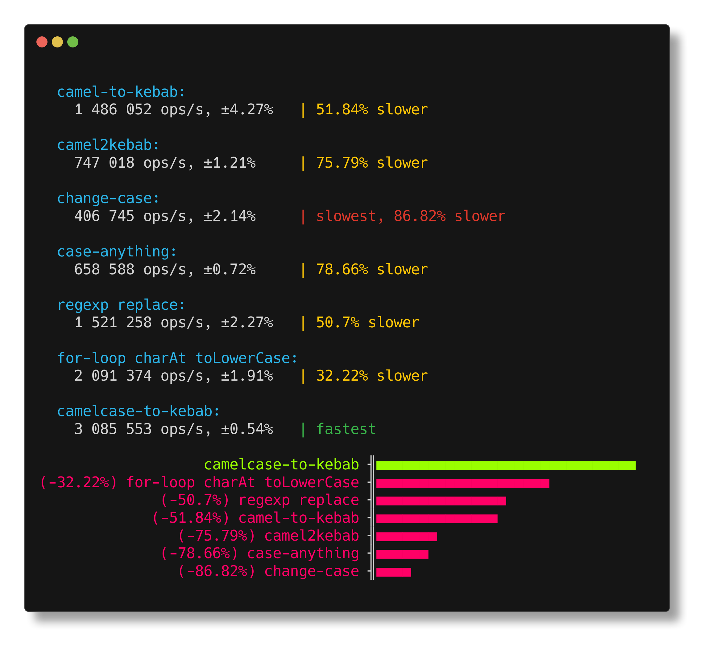

<h1 align="center">camelcase-to-kebab</h1>

<p align="center">
convert camelCase to kebab-case
</p>

<p align="center">
   <a href="#install">        🔧 <strong>Install</strong></a>
 · <a href="#example">        🧩 <strong>Example</strong></a>
 · <a href="#bench">          🚴 <strong>Bench</strong></a>
 · <a href="#api">            📜 <strong>API docs</strong></a>
 · <a href="https://github.com/stagas/kebab-to-camel/releases"> 🔥 <strong>Releases</strong></a>
 · <a href="#contribute">     💪🏼 <strong>Contribute</strong></a>
 · <a href="https://github.com/stagas/kebab-to-camel/issues">   🖐️ <strong>Help</strong></a>
</p>

***

## Install

```sh
$ npm i camelcase-to-kebab
```

## Example

```ts
import { camelCaseToKebab } from 'camelcase-to-kebab'

console.log(camelCaseToKebab('helloKebabWorld'))
// => hello-kebab-world
```

## Bench

`camelcase-to-kebab` performs best among the top downloaded packages in **npm** and is probably the fastest way to do it if you just want that conversion and not any-to-kebab:



## API

<!-- Generated by documentation.js. Update this documentation by updating the source code. -->

#### Table of Contents

*   [camelCaseToKebab](#camelcasetokebab)
    *   [Parameters](#parameters)

### camelCaseToKebab

[src/index.ts:7-18](https://github.com/stagas/camelcase-to-kebab/blob/7c0f6825bfa80b31939dda4d340409d9fd87b315/src/index.ts#L7-L18 "Source code on GitHub")

Converts a string from `camelCase` to `kebab-case`.

#### Parameters

*   `input` **[string](https://developer.mozilla.org/docs/Web/JavaScript/Reference/Global_Objects/String)** The string in `camelCase` to be converted

Returns **any** The string in `kebab-case`

## See also

*   [kebab-to-camel](https://github.com/stagas/kebab-to-camel) - convert kebab-case to camelCase

## Contribute

[Fork](https://github.com/stagas/camelcase-to-kebab/fork) or
[edit](https://github.dev/stagas/camelcase-to-kebab) and submit a PR.

All contributions are welcome!

## License

MIT © 2021
[stagas](https://github.com/stagas)
